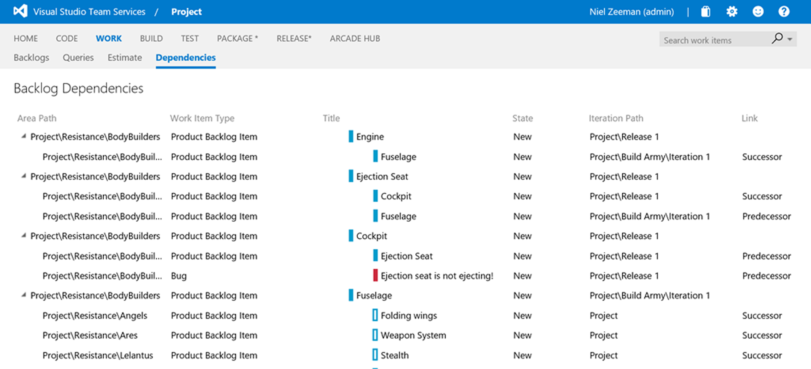

# Show Area Path Dependencies Extension

Agile teams do not rely on traditional project management techniques to track dependencies. 
This extension provides a lightweight way to manage dependencies on other teams.

## Quick steps to get started
1. Navigate to your backlog and review your backlog items
2. Select the "Dependencies" tab
3. A list of all the items on your backlog should display with all their dependencies (using the predecessor or successor links) 
4. Solid colored blocks are items under your area paths (i.e. on your backlog) and those with "empty" blocks are items on another teams backlog.

## Contributors

We thank the following contributor(s) for this extension: [Niel Zeeman](https://blogs.msdn.microsoft.com/willy-peter_schaub/2013/11/01/introducing-the-visual-studio-alm-rangers-niel-zeeman/) and [Steve St Jean](https://blogs.msdn.microsoft.com/willy-peter_schaub/2014/08/11/introducing-the-visual-studio-alm-rangers-steve-st-jean/).

<table>
  <tr>
    <td>
      </img>
    </td>
    <td>
      The Visual Studio ALM Rangers provide professional guidance, practical experience and gap-filling solutions to the ALM community. Visit <a href="http://aka.ms/vsarblog">aka.ms/vsarblog</a> to find out more.
    </td>
  </tr>
</table>

###Contribute
Contributions to Show Area Path Dependencies are welcome. Here is how you can contribute:  

- Submit bugs and help us verify fixes  
- Submit pull requests for bug fixes and features and discuss existing proposals   

Please refer to [Contribution guidelines](.github/CONTRIBUTING.md) and the [Code of Conduct](.github/COC.md) for more details.
